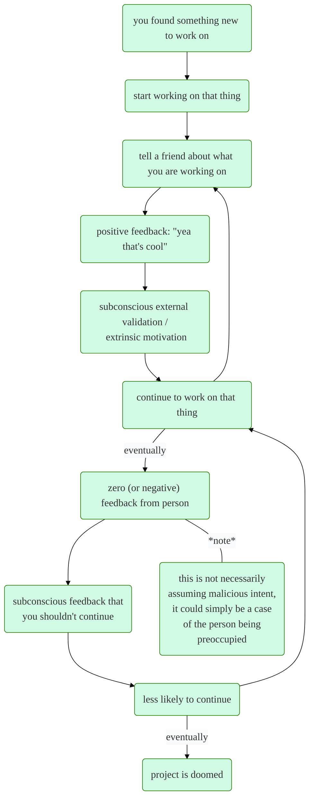
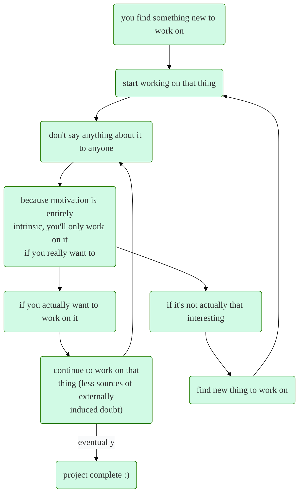

# the n2nbl strategy

recently I've been testing out a new strategy to squeeze some more value out of my free time. I started working full time a few months ago, and ever since then I've been trying to be *as productive as possible* with the hours I don't spend sleeping (sleep is cringe). As such, I have been trying to find new skills to build or projects to work on.

my idea for this strategy arose from wanting to avoid a situation I frequently find myself in: *I start to work on a new project or building a skill, but eventually end up dropping it* (shoutout coopm26). This brings me to assumption \#1 of the "need to know basis" loop strategy (n2nbl):

> assumption \#1: finding something you truly want to pursue (projects, skills, etc) can be really difficult, so by repeating this cycle **as many times as possible**, you increase your chances of finding something interesting.

in the past, this is what my productivity cycle looked like:

this whole loop is built upon two more assumptions:

> assumption \#2: any amount of feedback in the zero or negative direction subconsciously decreases your confidence. This amount of confidence decrease **doesn't have to be very large at all**; my point is a nonzero amount of doubt is being introduced.

> assumption \#3: other people do not (or cannot) 100% care about what you are doing with your time, it is **up to you entirely** to find out what you want to do.

obviously every situation is different, but I felt like this amount of problem distillation is entirely appropriate. Additionally, a core idea of this loop is that the extrinsic stimulus artificially boosts your motivation to finish a task and prolongs the time you spend on it (more on that later).

here is the proposed "n2nb" loop that I am currently testing:

this loop is built upon assumption \#4:

> assumption \#4: you are only going to do something if that matters to you, if you don't feel like doing it then it simply does not matter to you. This baseline of what **actually matters** is completely different depending on the person

the main idea here is that you kinda have to do some testing to find that personal baseline of what **actually matters**. For example, if I wanted to pick up something like basket weaving because it seemed interesting at the time, but I don't actually put a plan in motion to pursue basket weaving, then basket weaving is simply something that doesn't actually matter to me. 

in my experience, you can try to shift your perspective of what matters to you, but you'll only be able to get so far. If anything, the "what matters" baseline is probably defined by something like [maslow's heirarchy of needs](https://en.wikipedia.org/wiki/Maslow%27s_hierarchy_of_needs) which could explain why it is not as simple as thinking about it differently.

to summarize, I think the key to being more productive is to go through this n2nb-loop as many times as possible, and eventually you will find something that sticks *(assumption \#1)*. My issue with the first loop diagram is that extrinsic motivation is only good in moderation, and these outside factors can often result in you working on something longer than you should. After all, time is a very valuable resource 🙂

there are a few additional things that I think are important to note:
- not every activity can benefit from this strategy, some are inherently social
  - for example, playing a competitive team game with other people can push you to do better and keep up with everyone else's rate of improvement
- I dunno if this is actually effective yet I just came up with it one afternoon
  - (but I will eventually make an update)
- my assumptions could just be completely off base from other people's experiences
- I also might just be dumb and brain damaged

but yea if you read this far then thanks for your time, lmk what you think